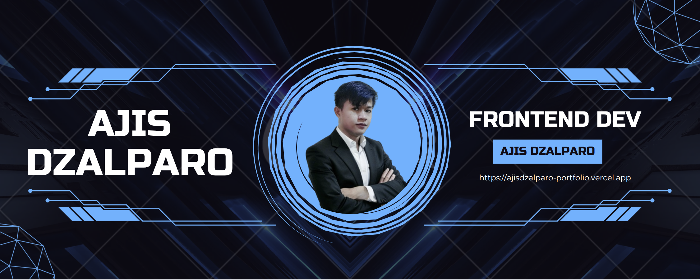

# 👾 Welcome to My GitHub Profile 👾

## 🧑‍💻 About Me

Hello! I'm **[Ajis Dzalparo](https://github.com/ajisdzalparo)**, a passionate **Frontend Developer**, **Software Engineer**, **Researcher**, and lifelong learner. Currently, I’m focused on building **innovative solutions** in the **Mechanical Engineering** and **AI** spaces, while also refining my **web development** skills.

- 💻 I specialize in **Frontend Development** with **React JS**, **Vue JS**, and **Laravel**. I also work with **Express JS** for backend development and **Full-Stack Web Development**.
- 🎶 Outside of tech, I’m a **deathcore** music enthusiast and an aspiring **musician**.

## 🌱 Currently Learning

- 🔍 Deepening my knowledge of **Next.js** and **Vue.js** for frontend development
- 💡 Exploring **penetration testing** and cybersecurity topics
- 💻 Enhancing my skills with **TypeScript**, **Redux**, **NextJs**, and **ReacJS**

## 🛠️ Tools & Technologies

- **Languages:**        
- **Frontend Frameworks & Libraries:**      
- **Backend Frameworks:**    

## 💬 Let's Connect!

- 🌐 [LinkedIn](https://www.linkedin.com/in/ajis-dzalparo-600646249/)
- 📝 [Portfolio Website](https://ajisdzalparo-portfolio.vercel.app/)
- 📧 Email me at: [ajisdzalparo22@gmail.com](ajisdzalparo22@gmail.com)

## 🚀 Highlighted Projects

- **[Guestbook System (Thesis Project)](https://github.com/ajisdzalparo):** A system built for managing guestbook entries, focusing on smooth user experience.
- **[Neveres Office Project (React JS)](https://github.com/ajisdzalparo):** Office system for the brand **Neveres**, utilizing React JS for efficient workflow management.
- **[Toko Lobo (React JS)](https://github.com/ajisdzalparo):** A React-based office system for **Toko Lobo**, implementing modern frontend practices.
- **[Simple E-Commerce (Vue JS)](https://github.com/ajisdzalparo):** A personal project for a basic e-commerce frontend using Vue JS.
- **[CRUD with Express JS](https://github.com/ajisdzalparo):** Learning and practicing **Express JS** through simple CRUD operations.

## My Github Stats

🔭 I’m always open to collaborating on projects that push boundaries and encourage growth! Let’s connect and create something amazing.

---

---
